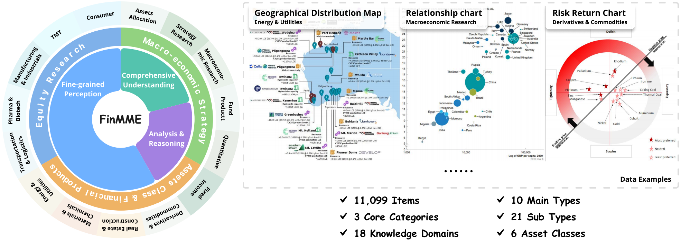

# FinMME: Benchmark Dataset for Financial Multi-Modal Reasoning Evaluation

[](https://huggingface.co/datasets/luojunyu/FinMME)
[](https://github.com/luo-junyu/FinMME)
[](https://opensource.org/licenses/MIT)

## 🔥 Overview

**FinMME** is a comprehensive benchmark dataset designed to evaluate Multimodal Large Language Models (MLLMs) in the financial domain. With over **11,000 high-quality financial samples** spanning **18 financial domains** and **6 asset classes**, FinMME provides a rigorous evaluation framework for financial multimodal reasoning capabilities.




## 🚀 Quick Start

### Installation

```bash
git clone https://github.com/luo-junyu/FinMME.git
cd FinMME
pip install -r requirements.txt
```

### Dataset Loading

```python
from datasets import load_dataset

# Load the dataset
dataset = load_dataset("luojunyu/FinMME", split="train")

# Access a sample
sample = dataset[0]
print(f"Question: {sample['question_text']}")
print(f"Answer: {sample['answer']}")
print(f"Question Type: {sample['question_type']}")
```

### Running Evaluation

```bash
# Basic test
python eval.py --sample_size 50 --num_processes 32

# Full evaluation
python eval.py 

# Custom evaluation
python eval.py --sample_size 100 --num_processes 16
```

#### Evaluation Parameters

- `--dataset`: Dataset name (default: `luojunyu/FinMME`)
- `--split`: Dataset split (default: `train`)
- `--sample_size`: Number of samples to evaluate (default: all)
- `--num_processes`: Number of parallel processes (default: 4)

### Configuration

Before running evaluation, configure your API settings in `eval.py`:

```python
model = "gpt-4o"  # Your model choice
api_key = 'YOUR_API_KEY'  # Your OpenAI API key
base_url = 'https://api.openai.com/v1'  # API endpoint
```

## 🏗️ Dataset Structure

### Question Types
- **Single Choice**: Multiple choice questions with one correct answer
- **Multiple Choice**: Questions with multiple correct answers
- **Numerical**: Calculation-based questions requiring numerical answers

### Financial Domains
- TMT (Technology, Media & Telecom)
- Consumer Goods
- Pharmaceuticals & Biotechnology
- Financial Services
- Real Estate & Construction
- Energy & Utilities
- And 12+ more specialized domains

### Asset Classes
- Equity
- Foreign Exchange
- Rates
- Commodity
- Credits
- Cross-Asset

## 🎯 Evaluation Methodology

### FinScore Calculation

FinScore combines domain-normalized performance with hallucination penalties:

```
FinScore = Domain_Normalized_Score × (1 - Hallucination_Penalty)
```

### Multi-dimensional Assessment

1. **Comprehensive Perception**: Temporal sequence recognition, multi-chart analysis
2. **Fine-grained Perception**: Numerical extraction, local variation analysis  
3. **Cognition & Reasoning**: Data inference, trend prediction, causal analysis


## 📚 Citation

If you use FinMME in your research, please cite:

```bibtex
@article{luo2024finmme,
  title={FINMME: Benchmark Dataset for Financial Multi-Modal Reasoning Evaluation},
  author={Luo, Junyu and Kou, Zhizhuo and Yang, Liming and Luo, Xiao and Huang, Jinsheng and Xiao, Zhiping and Peng, Jingshu and Liu, Chengzhong and Ji, Jiaming and Liu, Xuanzhe and Han, Sirui and Zhang, Ming and Guo, Yike},
  journal={ACL 2025},
  year={2024}
}
```
